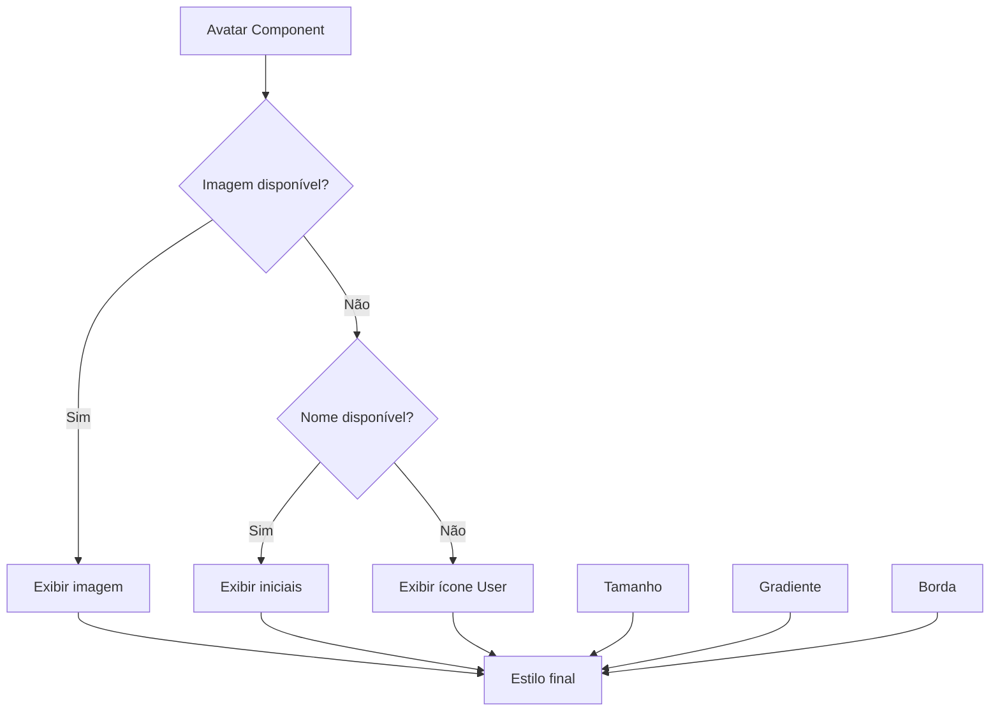

# Padrão de Avatares - Gestão Axé

## Visão Geral
Este documento define o padrão unificado para apresentação de avatares na aplicação Gestão Axé, alinhado com o Design System "Noite de Gira".

## Problema Identificado
Os avatares estavam sendo tratados de diversas formas diferentes na aplicação, causando inconsistências visuais:
- Tamanhos variáveis sem padrão
- Cores e gradientes inconsistentes
- Comportamento diferente para usuários sem foto
- Falta de reutilização de código

## Solução Proposta
Criação de um componente `Avatar` reutilizável com comportamento padronizado.

## Especificações Técnicas

### 1. Tamanhos Padronizados
| Tamanho | Dimensões (px) | Classe Tailwind | Uso Recomendado |
|---------|----------------|-----------------|-----------------|
| Small   | 32x32          | `w-8 h-8`       | Listas densas, comentários |
| Medium  | 40x40          | `w-10 h-10`     | Header, cards de membros |
| Large   | 48x48          | `w-12 h-12`     | Perfil, destaques |

### 2. Cores e Gradientes
Utilizar exclusivamente a paleta do Design System:

| Gradiente | Cores | Classe Tailwind | Uso |
|-----------|-------|-----------------|-----|
| Default   | Roxo → Dourado | `from-primary/50 to-accent/50` | Usuários padrão |
| Purple    | Roxo Profundo | `from-[#6D28D9]/60 to-[#7C3AED]/60` | Administradores |
| Gold      | Dourado Sagrado | `from-[#D97706]/60 to-[#F59E0B]/60` | Destaques |
| Green     | Verde Axé | `from-[#047857]/60 to-[#10B981]/60` | Novos membros |
| Blue      | Azul Profundo | `from-[#1D4ED8]/60 to-[#3B82F6]/60` | Convidados |

### 3. Comportamento Sem Foto
Quando não há imagem disponível (`src` é `null` ou `undefined`):
1. **Prioridade 1**: Mostrar iniciais do nome (se `name` fornecido)
   - Ex: "Maria Silva" → "MS"
   - Ex: "João" → "J"
2. **Prioridade 2**: Mostrar ícone `User` (lucide-react)
   - Tamanho proporcional ao avatar
   - Cor correspondente ao gradiente

### 4. Estilo Visual
- **Forma**: Circular (`rounded-full`)
- **Borda**: `border border-white/10` (opcional, default: `true`)
- **Sombra**: `shadow-sm` para profundidade
- **Fundo**: Glassmorphism com `bg-[#0F051D]/80` sobre gradiente
- **Hover**: Transições suaves (implementar no componente pai)

## Componente `Avatar`

### Props
```typescript
interface AvatarProps {
  src?: string | null;      // URL da imagem
  name?: string | null;     // Nome para gerar iniciais
  size?: "sm" | "md" | "lg"; // Tamanho (default: "md")
  className?: string;       // Classe CSS adicional
  bordered?: boolean;       // Mostrar borda (default: true)
  gradient?: "default" | "purple" | "gold" | "green" | "blue";
  icon?: React.ReactNode;   // Ícone personalizado
}
```

### Uso Básico
```tsx
import Avatar from "@/components/ui/avatar";

// Com imagem
<Avatar src="/avatar.jpg" name="Maria Silva" size="md" />

// Sem imagem, com nome
<Avatar name="João Santos" size="lg" gradient="gold" />

// Sem imagem, sem nome
<Avatar size="sm" />
```

## Componente `AvatarGroup`
Para exibir múltiplos avatares sobrepostos:

```tsx
import { AvatarGroup } from "@/components/ui/avatar";

<AvatarGroup
  avatars={[
    { src: "/avatar1.jpg", name: "Maria" },
    { src: "/avatar2.jpg", name: "João" },
    { name: "Ana" },
  ]}
  max={4}
  size="md"
/>
```

## Migração de Componentes Existentes

### 1. Header (`src/components/dashboard/header.tsx`)
**Antes**: Avatar customizado com inicial
**Depois**: 
```tsx
<Avatar 
  src={profile?.avatar_url}
  name={userName}
  size="md"
  bordered={true}
/>
```

### 2. Sidebar (`src/components/dashboard/sidebar.tsx`)
**Antes**: Avatar com gradiente fixo e ícone User
**Depois**:
```tsx
<Avatar 
  name="Armando"
  size="lg"
  gradient="purple"
  bordered={false}
/>
```

### 3. Dashboard - Aniversários (`src/app/dashboard/page.tsx`)
**Antes**: Avatar com gradiente personalizado e inicial
**Depois**:
```tsx
<Avatar
  name={evento.nome}
  size="md"
  gradient={evento.tipo === "aniversario" ? "gold" : "purple"}
/>
```

### 4. Dashboard - Recados (`src/app/dashboard/page.tsx`)
**Antes**: Avatar com gradiente dourado e iniciais
**Depois**:
```tsx
<Avatar
  name={recado.autor}
  size="sm"
  gradient="gold"
/>
```

## Regras de Implementação

1. **Sempre usar o componente `Avatar`** para qualquer representação visual de usuário
2. **Fornecer `name` quando disponível** para fallback consistente
3. **Escolher gradiente apropriado** baseado no contexto
4. **Manter consistência de tamanhos** dentro do mesmo contexto visual
5. **Testar ambos os estados**: com e sem imagem

## Exemplos Visuais



## Checklist de Implementação
- [ ] Criar componente `Avatar` em `src/components/ui/avatar.tsx`
- [ ] Atualizar componente Header para usar novo Avatar
- [ ] Atualizar componente Sidebar para usar novo Avatar  
- [ ] Atualizar página Dashboard (aniversários) para usar novo Avatar
- [ ] Atualizar página Dashboard (recados) para usar novo Avatar
- [ ] Testar todos os cenários (com/sem imagem, vários tamanhos)
- [ ] Validar acessibilidade (alt text, contraste)

## Benefícios
1. **Consistência visual** em toda aplicação
2. **Manutenibilidade** através de componente único
3. **Acessibilidade** com comportamento previsível
4. **Performance** com lazy loading e error handling
5. **Flexibilidade** com múltiplas opções de customização

---

*Documento criado em 11 de Fevereiro de 2026 como parte da padronização do Design System Gestão Axé.*