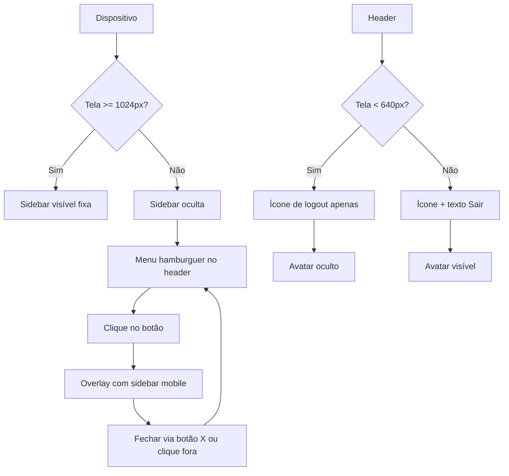

# Plano de Ajustes de Responsividade

## Objetivo
Revisar a responsividade de toda a aplicação e aplicar os ajustes necessários para garantir uma experiência otimizada em dispositivos móveis, tablets e desktops.

## Análise Atual

### Pontos Críticos Identificados

1. **Dashboard Grid**
   - Grid de 4 colunas colapsa para 2 colunas em md (768px) e 1 coluna em mobile.
   - Card "Próximos Eventos" ocupa `col-span-1 lg:col-span-3` que pode causar desalinhamento.
   - Grid interna do EventStrip usa `grid-cols-1 md:grid-cols-3` - em mobile fica uma coluna, mas pode ser muito alto.

2. **Sidebar**
   - Fixa em desktop, oculta em mobile (menu hamburguer).
   - Overlay mobile pode ter problemas de rolagem.

3. **Header**
   - Botão "Sair" esconde texto em mobile (`hidden xs:inline`).
   - Avatar e nome ocultos em mobile.

4. **KPICard**
   - `min-h-[180px]` muito alto para mobile.
   - Texto `text-7xl` grande demais.
   - Watermark icon `w-48 h-48` ocupa espaço excessivo.

5. **EventStrip**
   - Faixa lateral `w-16 md:w-20` larga para mobile.
   - Texto do dia `text-2xl` desproporcional.

6. **StandardCard**
   - Padding `p-6` grande para mobile.
   - Glow dourado `w-64 h-64` pode causar overflow.

7. **Feed de Recados (Aside)**
   - Oculto em mobile (`hidden lg:flex`).
   - Sem alternativa para visualizar recados.

8. **Páginas de Autenticação**
   - Já responsivas, mas podem melhorar breakpoints para telas muito pequenas.

9. **Textos Responsivos**
   - `text-4xl md:text-5xl` no financeiro pode quebrar linha.

10. **Scrollbars**
    - Customização pode não funcionar em todos os navegadores.

11. **Indicador "Modo Mobile"**
    - Fixo no canto pode atrapalhar.

## Plano de Ajustes por Componente

### 1. Dashboard Grid (`src/app/dashboard/page.tsx`)

**Propostas:**
- Alterar grid principal para `grid-cols-1 sm:grid-cols-2 lg:grid-cols-4` (adicionar breakpoint sm).
- Ajustar card "Próximos Eventos" para `col-span-1 sm:col-span-2 lg:col-span-3` (ocupar 2 colunas em sm).
- Grid interna do EventStrip: `grid-cols-1 sm:grid-cols-2 lg:grid-cols-3` (2 colunas em tablets).
- Ajustar padding do main: `p-3 sm:p-4 md:p-6`.
- Reduzir `gap-6 md:gap-8` para `gap-4 sm:gap-6 md:gap-8`.

### 2. Sidebar (`src/components/dashboard/sidebar.tsx`)

**Propostas:**
- No mobile overlay, garantir altura máxima e scroll interno.
- Ajustar tamanho da fonte dos itens de navegação para mobile.
- Adicionar `safe-area-inset` para iPhone com notch.

### 3. Header (`src/components/dashboard/header.tsx`)

**Propostas:**
- Manter ícone de logout em mobile, sem texto (ou texto menor).
- Mostrar avatar em mobile (sm) com tamanho reduzido.
- Ajustar padding: `px-3 sm:px-4 md:px-6`.

### 4. KPICard (`src/components/dashboard/kpi-card.tsx`)

**Propostas:**
- Reduzir `min-h-[180px]` para `min-h-[140px] sm:min-h-[160px] lg:min-h-[180px]`.
- Texto do valor: `text-5xl sm:text-6xl lg:text-7xl`.
- Watermark icon: `w-32 h-32 sm:w-40 sm:h-40 lg:w-48 lg:h-48`.
- Ajustar padding: `p-4 sm:p-6`.

### 5. EventStrip (`src/components/dashboard/event-strip.tsx`)

**Propostas:**
- Faixa lateral: `w-12 sm:w-16 md:w-20`.
- Texto do dia: `text-xl sm:text-2xl`.
- Texto do mês: `text-[9px] sm:text-[10px]`.
- Padding interno: `p-2 sm:p-3`.

### 6. StandardCard (`src/components/dashboard/standard-card.tsx`)

**Propostas:**
- Padding: `p-4 sm:p-6`.
- Glow dourado: `w-40 h-40 sm:w-56 sm:h-56 lg:w-64 lg:h-64`.
- Ajustar altura automática.

### 7. Feed de Recados

**Propostas:**
- Em mobile, substituir por um botão flutuante que abre um drawer.
- Ou exibir uma seção recolhível abaixo do grid principal.
- Implementar componente `MobileRecadosDrawer`.

### 8. Páginas de Autenticação

**Propostas:**
- Ajustar breakpoints para `max-w-xs` em telas muito pequenas.
- Reduzir padding: `p-2 sm:p-4 md:p-6`.

### 9. Textos Responsivos

**Propostas:**
- Usar classes Tailwind responsivas: `text-3xl sm:text-4xl md:text-5xl`.
- Garantir `line-clamp` onde necessário.

### 10. Scrollbars

**Propostas:**
- Adicionar fallback para navegadores que não suportam `scrollbar-thin`.
- Esconder scrollbar em mobile quando não essencial.

### 11. Remover Indicador "Modo Mobile"

**Propostas:**
- Remover div com `Modo Mobile` (linha 319-321 do dashboard/page.tsx).

## Ordem de Implementação

1. Ajustar layout do dashboard (grid, breakpoints)
2. Otimizar sidebar e header para mobile
3. Ajustar cards (KPICard, StandardCard, EventStrip)
4. Melhorar feed de recados para mobile
5. Revisar páginas de autenticação
6. Testar responsividade
7. Documentar alterações

## Critérios de Aceitação

- A aplicação deve ser utilizável em telas a partir de 320px de largura.
- Textos devem ser legíveis sem zoom.
- Botões e elementos interativos devem ter tamanho mínimo de 44px.
- Layout não deve quebrar em nenhum breakpoint.
- Performance de renderização mantida.

## Ajustes Detalhados por Componente

### KPICard

| Propriedade | Atual | Proposto |
|-------------|-------|----------|
| `min-height` | `min-h-[180px]` | `min-h-[140px] sm:min-h-[160px] lg:min-h-[180px]` |
| `font-size` do valor | `text-7xl` | `text-5xl sm:text-6xl lg:text-7xl` |
| Watermark icon size | `w-48 h-48` | `w-32 h-32 sm:w-40 sm:h-40 lg:w-48 lg:h-48` |
| Padding | `p-6` | `p-4 sm:p-6` |
| Label font size | `text-xs` | `text-[10px] sm:text-xs` |

### EventStrip

| Propriedade | Atual | Proposto |
|-------------|-------|----------|
| Faixa lateral width | `w-16 md:w-20` | `w-12 sm:w-16 md:w-20` |
| Dia font size | `text-2xl` | `text-xl sm:text-2xl` |
| Mês font size | `text-[10px]` | `text-[9px] sm:text-[10px]` |
| Padding interno | `p-3` | `p-2 sm:p-3` |
| Badge de hora | `text-[10px]` | `text-[9px] sm:text-[10px]` |

### StandardCard

| Propriedade | Atual | Proposto |
|-------------|-------|----------|
| Padding | `p-6` | `p-4 sm:p-6` |
| Glow dourado size | `w-64 h-64` | `w-40 h-40 sm:w-56 sm:h-56 lg:w-64 lg:h-64` |
| Header icon size | `w-5 h-5` | `w-4 h-4 sm:w-5 sm:h-5` |
| Title font size | `text-sm` | `text-xs sm:text-sm` |

### Feed de Recados (Aside)

**Problema:** Atualmente oculto em mobile (`hidden lg:flex`), os usuários não têm acesso aos recados em telas pequenas.

**Solução 1:** Drawer móvel
- Adicionar botão flutuante no canto inferior direito (ícone de mensagem).
- Ao clicar, abre um drawer com a lista de recados e campo de input.
- Implementar componente `MobileRecadosDrawer` que reutiliza o conteúdo do aside.

**Solução 2:** Aba recolhível
- Em mobile, exibir uma barra superior "Mural do Terreiro" que expande ao tocar.
- Usar `details`/`summary` ou componente accordion.

**Implementação preferida:**
- Criar um contexto de recados para compartilhar estado.
- No dashboard, condicionalmente renderizar o aside em desktop e o drawer em mobile.
- Usar `useMediaQuery` para detectar breakpoint.

**Ajustes de layout:**
- No drawer, ajustar altura para `max-h-[70vh]`.
- Garantir que o input de mensagem tenha `min-height` adequado.
- Adicionar botão de fechar.

### Páginas de Autenticação (Login, Signup, Onboarding)

**Análise:** As páginas já possuem responsividade básica com breakpoints `sm` e `md`. No entanto, em telas muito pequenas (< 375px), alguns elementos podem ficar apertados.

**Ajustes propostos:**

1. **Login & Signup:**
   - Reduzir `max-w-sm` para `max-w-xs` em telas < 375px.
   - Ajustar padding do card: `p-3 sm:p-4 md:p-6` → `p-2.5 sm:p-4 md:p-6`.
   - Reduzir tamanho da fonte do título: `text-xl sm:text-2xl` → `text-lg sm:text-xl md:text-2xl`.
   - Aumentar área de toque dos botões.

2. **Onboarding:**
   - Card com `max-w-lg sm:max-w-2xl` pode ser muito largo para mobile.
   - Adicionar `max-w-xs` para telas pequenas.
   - Ajustar grid dos inputs para `grid-cols-1` (já está).
   - Reduzir padding do card content: `p-4 sm:p-6` → `p-3 sm:p-4 md:p-6`.

3. **Melhorias gerais:**
   - Garantir que inputs tenham `font-size: 16px` para evitar zoom no iOS.
   - Adicionar `min-height` aos botões para melhor toque.
   - Usar `gap-3` em vez de `gap-4` em mobile.

**Exemplo de código para media query customizada:**
```css
@media (max-width: 375px) {
  .auth-card {
    max-width: 18rem;
  }
}
```

## Testes de Responsividade

### Métodos de Teste

1. **Ferramentas de Desenvolvedor do Navegador**
   - Usar o device toolbar do Chrome/Firefox para simular tamanhos de tela.
   - Testar breakpoints: 320px (iPhone SE), 375px (iPhone 12), 768px (iPad), 1024px (iPad Pro), 1280px (desktop).

2. **Testes Manuais**
   - Navegar pela aplicação em cada tamanho.
   - Verificar se textos não ultrapassam limites.
   - Garantir que botões sejam clicáveis (tamanho mínimo 44px).
   - Checar se não há overflow horizontal.

3. **Testes Automatizados (futuro)**
   - Configurar testes com Playwright ou Cypress para capturar screenshots em diferentes viewports.
   - Usar ferramentas como Percy para detecção de regressões visuais.

### Checklist de Testes

- [ ] Dashboard: Grid se adapta corretamente em mobile, tablet, desktop.
- [ ] Sidebar: Overlay mobile abre e fecha sem problemas.
- [ ] Header: Botões e avatar são visíveis e acessíveis.
- [ ] Cards: Textos não quebram, altura adequada.
- [ ] Feed de recados: Drawer mobile funciona.
- [ ] Páginas de autenticação: Formulários são usáveis em telas pequenas.
- [ ] Navegação: Links e botões não sobrepostos.
- [ ] Scroll: Conteúdo rola suavemente, scrollbars não atrapalham.
- [ ] Imagens: Responsivas e não distorcidas.
- [ ] Tipografia: Tamanhos de fonte adequados.

### Ferramentas Recomendadas

- **Chrome DevTools:** Device mode, Lighthouse para auditoria de acessibilidade.
- **Responsively App:** Aplicativo para testar múltiplas resoluções simultaneamente.
- **BrowserStack:** Teste em dispositivos reais (se disponível).

## Documentação das Alterações

### Arquivos a Serem Modificados

1. `src/app/dashboard/page.tsx` – Ajustes de grid, padding, remoção do indicador mobile.
2. `src/components/dashboard/sidebar.tsx` – Ajustes de padding e fontes para mobile.
3. `src/components/dashboard/header.tsx` – Ajustes de botão de logout e avatar.
4. `src/components/dashboard/kpi-card.tsx` – Redução de tamanhos responsivos.
5. `src/components/dashboard/event-strip.tsx` – Ajustes de largura e fontes.
6. `src/components/dashboard/standard-card.tsx` – Ajustes de padding e glow.
7. `src/app/globals.css` – Adição de regras CSS responsivas (se necessário).
8. `src/app/login/page.tsx`, `signup/page.tsx`, `onboarding/page.tsx` – Ajustes de breakpoints.
9. Novo componente: `src/components/dashboard/mobile-recados-drawer.tsx` – Drawer para recados em mobile.

### Registro de Mudanças

Cada alteração deve ser acompanhada de atualização nos arquivos de documentação:

- `docs/DESIGN_SYSTEM.md` – Atualizar tokens de breakpoint se necessário.
- `README.md` – Adicionar nota sobre responsividade.
- `docs/ARCHITECTURE.md` – Documentar decisões de design responsivo.

### Considerações de Acessibilidade

- Garantir contraste adequado em todos os tamanhos de tela.
- Manibir ordem de tabulação lógica em mobile.
- Fornecer labels acessíveis para ícones.

## Conclusão

Este plano detalha as ações necessárias para revisar e melhorar a responsividade da aplicação Gestão Axé. As mudanças propostas visam garantir uma experiência de usuário consistente e acessível em todos os dispositivos.

O próximo passo é executar as modificações no modo Code.

## Fluxo de Responsividade do Sidebar e Header



## Próximos Passos

Este plano será executado no modo Code após aprovação do usuário.